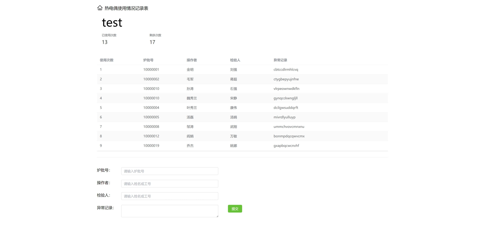

# 热电偶记录的一个小网页

- 使用 Nuxt 3， prisma， tailwindcss，以及 element-plus，具体看 package.json
- 数据库使用 mysql，具体见 prisma 的配置文件 schema.prisma
- 测试的两组数据，在搜索框中输入 test 或 test2

## 安装依赖

在安装依赖前，将prisma文件夹改个名字，否则安装prisma时会自动加载schema.prisma，然后卡很久

其它基本和 Nuxt 官网一样

```bash
# npm
npm install

# pnpm
pnpm install

# yarn
yarn install
```

## prisma 客户端

将 prisma 文件夹改回，重新生成 prisma 客户端

```bash
npx prisma generate
```

## 开发服务

服务器地址 `http://localhost:3000`:

```bash
# npm
npm run dev

# pnpm
pnpm run dev

# yarn
yarn dev
```

## 生成生产环境文件

使用 Build

```bash
# npm
npm run build

# pnpm
pnpm run build

# yarn
yarn build
```

本地预览

```bash
# npm
npm run preview

# pnpm
pnpm run preview

# yarn
yarn preview
```

## 部署

更改 `\server\api\records\[name].get.js` 中的 `DATABASE_URL` 为正式的数据库地址

进行 build

按提示执行 `node .output/server/index.mjs`

# 预览


